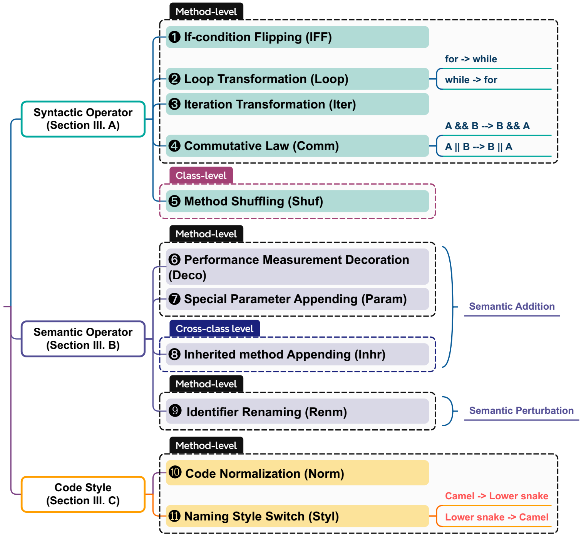
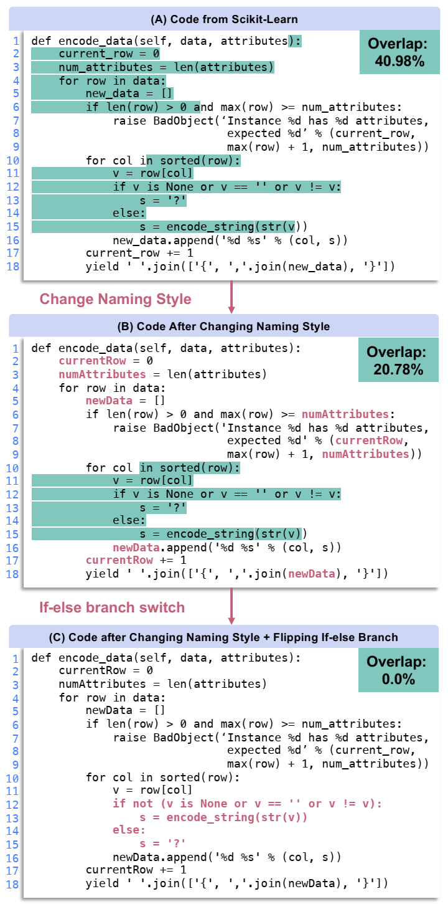
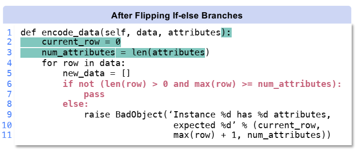
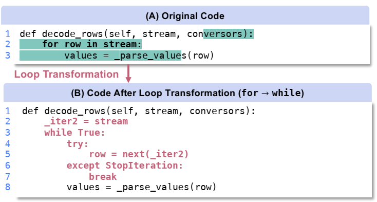
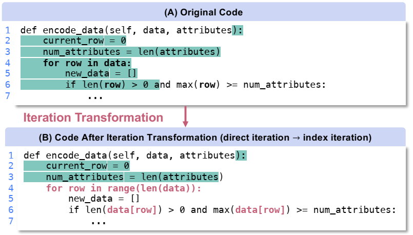
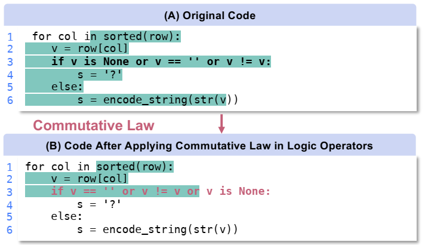
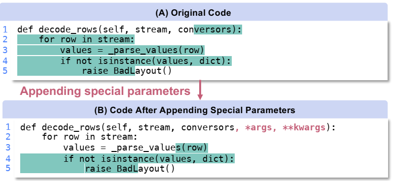
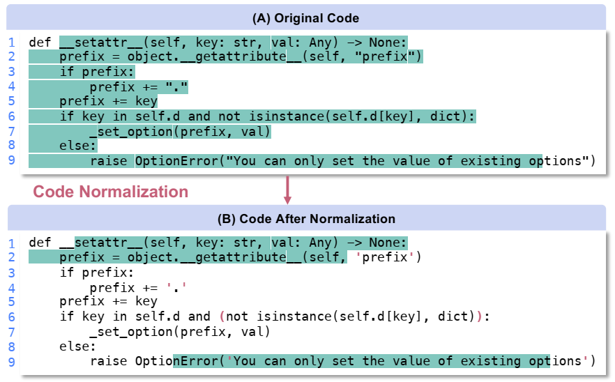

# CodeCleaner

CodeCleaner is an automated code refactoring toolkit for mitigating data contamination in evaluating code language models (CLMs). 
- It performs code refactoring to resolve data contamination following the idea of **disrupting the consecutive characters/tokens as much as possible while maintaining the semantic unchanged**.
- It includes 11 refactoring operators applicable to Python and Java codes, covering structure, semantics, and code style refactoring.



_An example to illustrate the key idea, where the N-gram matching overlap ratio between the given code and the Stack-v1 training corpus drops dramatically after refactoring: (click the image or [here](Figure/example1.png) to zoom in)_



---

This is the artifact of CodeCleaner - ICSE Industry Challenge 2025. 
It includes: 
1) implementation of the CodeCleaner refactoring toolkit (9 method-level and 2 class-level Python refactoring operators;
2) toolkit demo Jupyter notebooks;
3) data for obtaining the study results presented in our paper;
4) scripts for reproducing our study (e.g., the scripts for calculating overlap ratio and perplexity).

# Refactoring Operators & Illustrative Examples

## Syntactic Refactoring Operators

### If-condition Flipping (IFF)

This operator negates the if-condition and flips the statements in `if`- and `else`-branches.




### Loop Transformation (Loop)

This operator switches `while` loops with the equivalent `for` loop.




### Iteration Transformation (Iter)

In Python, there are two ways to iterate over an iterable object, i.e., to directly access each element or use indices within a range. This operator transforms code between these two ways.




### Commutative Law Flipping (Comm)

This operator performs commutative law in logical operations.




### (Class-level) Method Shuffling (Shuf)

Negate the if-condition and flip the statements in if- and else-branches.


## Semantic Refactoring Operators

### Special Parameter Appending (Param)

This operator appends these parameters if they do not exist in the original method declarations.




### Performance Measurement Decoration (Deco)

This operator adds two decorators not affecting method functions, i.e., `@timing` (measuring the execution time) and `@measure_memory_usage` (measuring the memory usage), to Python methods.


### (Cross-Class) Inherited method Appending (Inhr)

For the classes that inherit from superclasses, this operator copies methods from the superclasses to the (sub)class if these methods are not overridden in the subclass.


### Identifier Renaming (Renm)

This operator replaces the identifiers in the source code with their corresponding synonyms.


## Code Styles Refactoring Operators

### Code Normalization (Norm)

This operator performs normalization on the code styles, such as unifying single and double quote marks, regularizing the number of spaces, and using parentheses to indicate operation precedence.




### Naming Style Switch (Styl)

The camel case (e.g., camelCase) and lower snake case (e.g., lower_snake) are two popularly-used naming conventions in programming. This operator transforms identifier names between these two styles.


## Demo Jupyter Notebooks

We provide Jupyter notebooks to illustrate the usage of our toolkit to perform refactoring based on the operators introduced above.
- [Jupyter notebook demo of Method-level Refactoring](src/refactoring-demo-method.ipynb)
- [Jupyter notebook demo of Class-level Refactoring](src/refactoring-demo-class.ipynb)


# File Structure of Artifact
```
/CodeCleaner's Artifact
    /src            # Source files of tools, experiment scripts, demos, etc.
        /utils      # Key source files of tools
        {xxx}.ipynb # Demo Jupyter Notebooks
        {xxx}.py    # Source files & scripts
    /data           # Data used by the study conducted in the paper
        /data-{type}# {type} in {pymethod2021, pyclass324, year, java} corresponding to the data for RQ1-4
            /{opr}/question.jsonl          # Storing the corresponding code entities refactored with {opr}
                /model_score               # The models' MIA-related scores for the codes refactored with {opr}
            /overlap_v1/overlap{opr}.txt   # The overlap calculation record for the codes refactored with {opr}
    /Figures        # Illustrations for our toolkit
    README.md
    LICENSE
    requirements.txt# or other dependency management files
```
